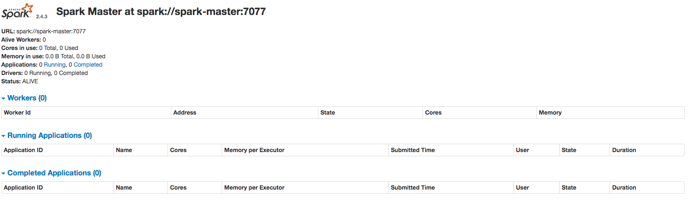
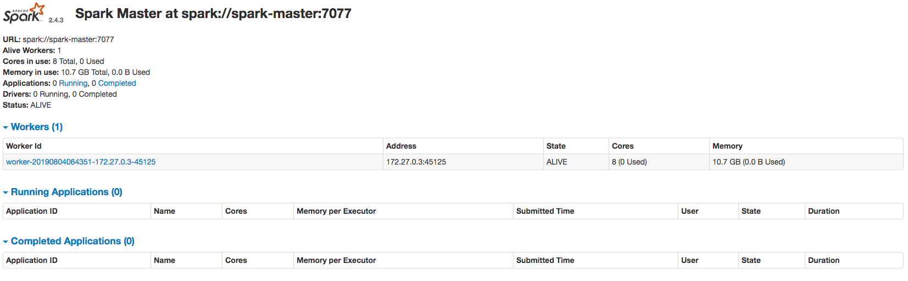

## Building the image  

Create a ***Dockerfile***  

```docker
FROM openjdk:8-alpine
```
Build the image, using your preferred tag  

```bash
$ docker build -t izhar/spark:latest .
```  

Test the image  

```bash
$ docker run -it izhar/spark:latest /bin/sh
/ # java -version
openjdk version "1.8.0_212"
OpenJDK Runtime Environment (IcedTea 3.12.0) (Alpine 8.212.04-r0)
OpenJDK 64-Bit Server VM (build 25.212-b04, mixed mode)
/ #
```  

Add following line to ***Dockerfile***, and rebuild  

```docker
RUN apk --update add wget tar bash
```  

```bash
$ docker build -t izhar/spark:latest .
```  

Download spark, and extract into place  

Add to ***Dockerfile***  

```docker  
RUN wget http://apache.mivzakim.net/spark/spark-2.4.3/spark-2.4.3-bin-hadoop2.7.tgz
RUN tar -xzf spark-2.4.3-bin-hadoop2.7.tgz && \
    mv spark-2.4.3-bin-hadoop2.7 /spark && \
    rm spark-2.4.3-bin-hadoop2.7.tgz
```  
> The [Apache Spark Download site](https://spark.apache.org/downloads.html)  

Rebuild  

``bash
$ docker build -t izhar/spark:latest .
```  

Create a docker network to allow master to workers connectivity  

```bash
$ docker network create spark_network
```  

Launch the container   

```bash
docker run --rm -it --name spark-master --hostname spark-master -p 7077:7077 -p 8080:8080 --network spark_network izhar/spark:latest /bin/bash
```  

Launch spark  

```bash
bash-4.4# /spark/bin/spark-class org.apache.spark.deploy.master.Master --ip `hostname` --port 7077 --webui-port 8080
```  

Point the browser to ***http://localhost:8080***  

  

Add a worker node  

Launch the same image, same params & network, different name  

```bash
$ docker run --rm -it --name spark-worker --hostname spark-worker --network spark_network izhar/spark:latest /bin/bash
```  

Launch the worker process inside the worker container  

```bash
$ /spark/bin/spark-class org.apache.spark.deploy.worker.Worker --webui-port 8080 spark://spark-master:7077
```  

Refresh the browser to verify Worker has regsitered with Master  

  

Configuring docker-compose  

We csan use docker compose to automate the master worker wiring. Before writing the file, we need to write some startup scripts, for the Master ans Worker, and rebuild the image for docker-compose to use  

create ***dockerfile_scripts*** dir  

Add thr following scripts to it  

***start-master.sh***  
```bin
$ #!/bin/bash
/spark/bin/spark-class org.apache.spark.deploy.master.Master --ip $SPARK_LOCAL_IP --port $SPARK_MASTER_PORT --webui-port $SPARK_MASTER_WEBUI_PORT
```  

***start-worker.sh***  
```bin
$ #!/bin/bash
/spark/bin/spark-class org.apache.spark.deploy.worker.Worker --webui-port $SPARK_WORKER_WEBUI_PORT $SPARK_MASTER
```  

Grant them exec permission  

```bash
$ chmod +x ./start-master.sh
$ chmod +x ./start-worker.sh
```  

Add the following lines to the end of the ***Dockerfile***  

```bash
COPY ./dockerfile_scripts/start-master.sh /start-master.sh
COPY ./dockerfile_scripts/start-worker.sh /start-worker.sh
```  

Rebuild the image  

```bash  
$ docker build -t izhar/spark:latest .
```

Now the ***docker-compose.yml***:  

```yaml
version: "3.3"
services:
  spark-master:
    image: izhar/spark:latest
    container_name: spark-master
    hostname: spark-master
    ports:
      - "8080:8080"
      - "7077:7077"
    networks:
      - spark-network
    environment:
      - "SPARK_LOCAL_IP=spark-master"
      - "SPARK_MASTER_PORT=7077"
      - "SPARK_MASTER_WEBUI_PORT=8080"
    command: "/start-master.sh"
  spark-worker:
    image: izhar/spark:latest
    depends_on:
      - spark-master
    ports:
      - 8080
    networks:
      - spark-network
    environment:
      - "SPARK_MASTER=spark://spark-master:7077"
      - "SPARK_WORKER_WEBUI_PORT=8080"
    command: "/start-worker.sh"
networks:
  spark-network:
    driver: bridge
    ipam:
      driver: default
```  

To launch the cluster  

```bash  
$ docker-compose up
```  

And to laung more workers  

```bash  
$ docker-compose up  --scale spark-worker=3
```  

Once the cluster is up, you can use the ***launch_spark_shell.sh*** to launch a shell against the running cluster  

